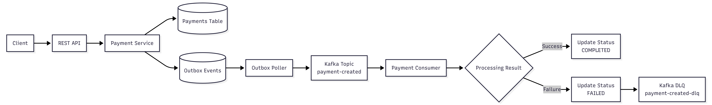
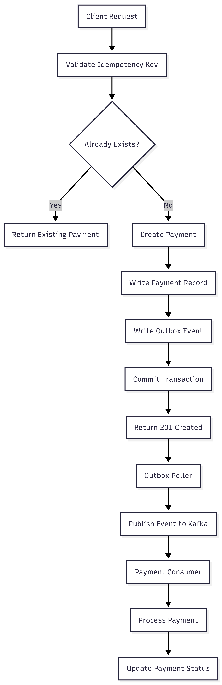
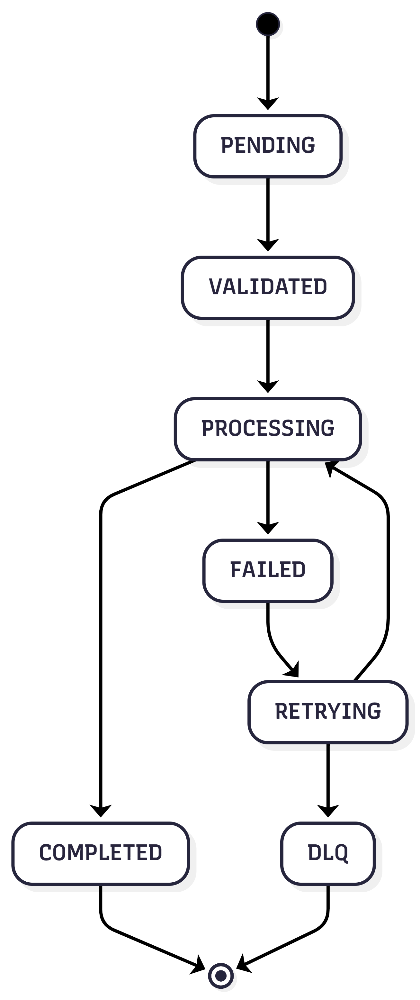
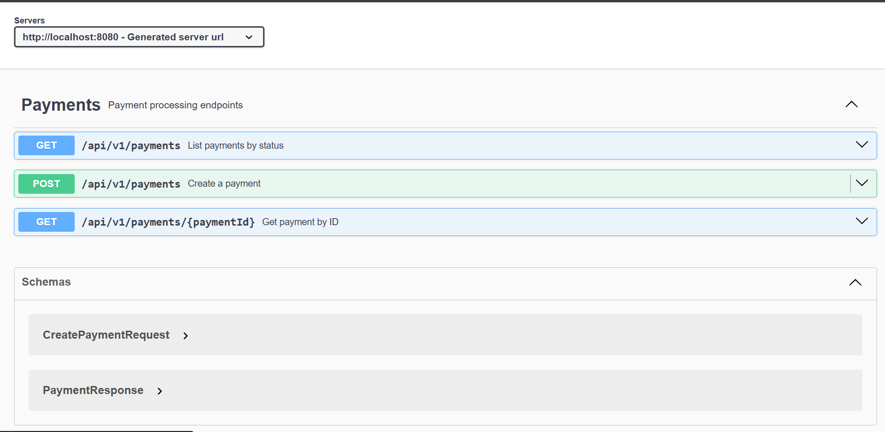
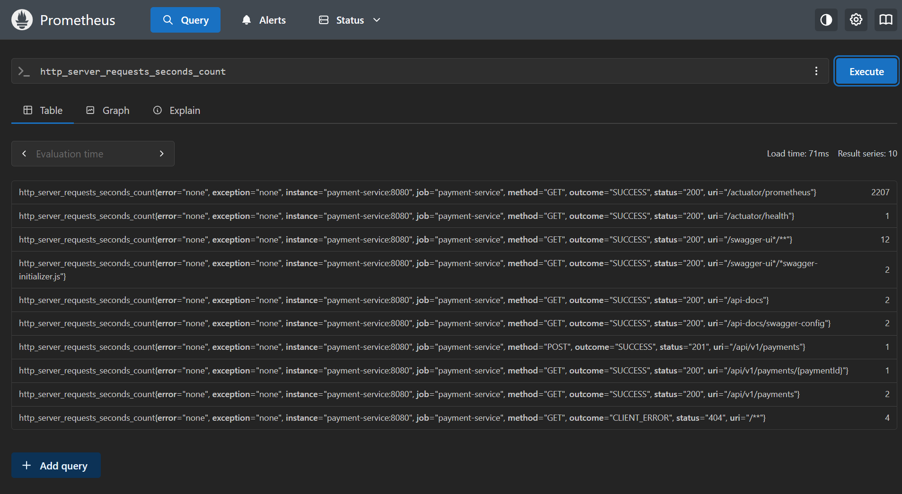
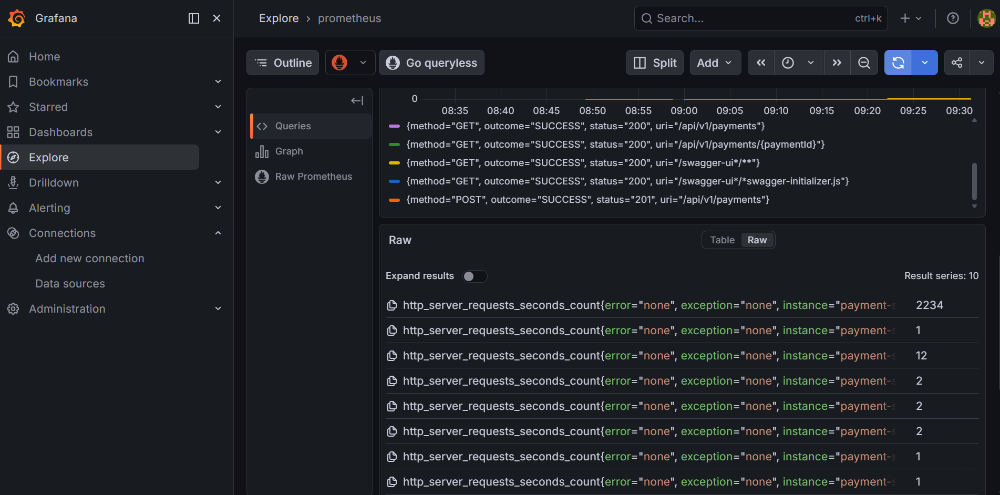

# Fintech Payment Engine


A production-grade payment processing platform built with **Java 17**, **Spring Boot**, **Apache Kafka**, and **PostgreSQL**.

This project demonstrates key architectural patterns commonly used in modern financial systems, including **idempotent APIs**, **transactional outbox**, **event-driven processing**, **dead-letter queues**, **observability**, and **resilient payment workflows**.

---

## Overview

Building reliable payment systems requires much more than simple CRUD operations.

Financial platforms must guarantee:

* Consistency
* Reliability
* Auditability
* Failure Recovery
* Safe Retries
* High Observability

This project implements these requirements through a realistic payment processing architecture inspired by production fintech systems.

---

## Architecture



---

## High-Level Flow



---

## Architecture Patterns

This project implements several production-grade backend patterns:

* Idempotent API Design
* Transactional Outbox Pattern
* Event-Driven Processing
* Kafka Retry & Dead Letter Queue
* Exponential Backoff
* Observability-Driven Development
* Database-Backed Consistency Guarantees

---

## Production Features

### Payment Processing

* Payment Creation API
* Payment Status Tracking
* Asynchronous Processing
* Event-Driven Architecture

### Reliability

* Idempotent Payment Creation
* Transactional Outbox Pattern
* Kafka Retry Strategy
* Dead Letter Queue (DLQ)
* Exponential Backoff

### Data Integrity

* PostgreSQL ACID Transactions
* Strong Consistency Guarantees
* Database Constraints
* Outbox Consistency

### Observability

* Spring Boot Actuator
* Micrometer Metrics
* Prometheus Monitoring
* Grafana Dashboards

### Platform Engineering

* Docker Compose Environment
* Kubernetes Deployment Manifests
* OpenAPI Documentation
* Integration Testing with Testcontainers
* GitHub Actions CI Pipeline

---

## Key Design Decisions

### Why Kafka?

Payment creation and payment processing are intentionally decoupled.

The API responds immediately after persistence while payment processing continues asynchronously.

Benefits:

* Better Throughput
* Lower API Latency
* Improved Scalability
* Loose Coupling Between Services

---

### Why Idempotency Keys?

Financial systems must never process the same payment twice.

Each request requires an idempotency key.

If a client retries a request because of a timeout or network issue, the original payment is returned instead of creating a duplicate transaction.

---

### Why the Transactional Outbox Pattern?

Without an outbox pattern:

```text
Save Payment
      +
Publish Kafka Event
```

A failure between these operations may leave the system in an inconsistent state:

```text
Payment Saved
Event Lost
```

The Transactional Outbox Pattern guarantees that payment data and emitted events remain consistent.

---

### Why a Dead Letter Queue?

Some events cannot be processed successfully.

Examples:

* Malformed Messages
* Downstream Service Failures
* Unexpected Exceptions

Instead of blocking the main processing flow, failed events are routed to a dedicated Dead Letter Queue for investigation and replay.

---

### Why Exponential Backoff?

Not every failure is permanent.

Transient issues such as:

* Network Timeouts
* Database Connectivity Problems
* Temporary Service Outages

can often recover automatically.

Exponential backoff reduces unnecessary load while improving resilience.

---

### Why PostgreSQL?

Financial data requires strong consistency guarantees.

PostgreSQL provides:

* ACID Transactions
* Strong Durability
* Reliable Concurrency Handling
* Mature Production Tooling

making it an excellent choice for payment systems.

---

## Technology Stack

| Layer             | Technology               |
| ----------------- | ------------------------ |
| Language          | Java 17                  |
| Framework         | Spring Boot 3.2          |
| Messaging         | Apache Kafka             |
| Database          | PostgreSQL 15            |
| Monitoring        | Prometheus               |
| Dashboards        | Grafana                  |
| Metrics           | Micrometer               |
| API Documentation | OpenAPI 3                |
| Testing           | JUnit 5 + Testcontainers |
| CI/CD             | GitHub Actions           |
| Containerization  | Docker                   |
| Orchestration     | Kubernetes               |

---

## Running Locally

### Prerequisites

* Docker
* Docker Compose

### Start the Environment

```bash
git clone https://github.com/babacar-niang/fintech-payment-engine.git

cd fintech-payment-engine

docker-compose up --build
```

---

## Available Services

| Service     | URL                                         |
| ----------- | ------------------------------------------- |
| Payment API | http://localhost:8080                       |
| Swagger UI  | http://localhost:8080/swagger-ui/index.html |
| Prometheus  | http://localhost:9090                       |
| Grafana     | http://localhost:3000                       |

Default Grafana Credentials:

```text
Username: admin
Password: admin
```

---

## API Reference

### Create Payment

```http
POST /api/v1/payments
Idempotency-Key: payment-001
Content-Type: application/json
```

```json
{
  "amount": 50000,
  "currency": "XOF",
  "senderId": "USER_001",
  "receiverId": "MERCHANT_001",
  "reference": "ORDER-1001"
}
```

### Get Payment

```http
GET /api/v1/payments/{paymentId}
```

### List Payments

```http
GET /api/v1/payments?status=PENDING
GET /api/v1/payments?status=COMPLETED
GET /api/v1/payments?status=FAILED
```

---

## Payment Lifecycle



---

## Observability

Metrics are exposed through:

```text
/actuator/prometheus
```

Example metrics:

```text
payments_created_total
payments_completed_total
payments_failed_total
payment_processing_duration_seconds
```
---
## Monitoring Configuration

Prometheus is configured to scrape application metrics exposed by Spring Boot Actuator.

Configuration file:

```text
docs/prometheus.yml
Example:
global:
  scrape_interval: 15s

scrape_configs:
  - job_name: 'payment-service'
    metrics_path: '/actuator/prometheus'
    static_configs:
      - targets: ['payment-service:8080']
```
This configuration allows Prometheus to collect metrics from the payment service and visualize them through Grafana dashboards.

---

## Screenshots

### Swagger UI



### Prometheus Metrics



### Grafana Dashboard



---

## Testing

Run all tests:

```bash
cd payment-service

./mvnw test
```

The project uses Testcontainers, allowing integration tests to run against real PostgreSQL and Kafka instances without requiring local installations.

---

## Project Structure

fintech-payment-engine/
│
├── docs/
│   ├── payment-architecture.png
│   ├── high-level-flow.png
│   ├── payment-lifecycle.png
│   ├── swagger-ui.png
│   ├── prometheus-metrics.png
│   ├── grafana-dashboard.png
│   └── prometheus.yml
│
├── k8s/
│   └── deployment.yaml
│
├── payment-service/
│   ├── Dockerfile
│   ├── pom.xml
│   └── src/
│       ├── main/
│       │   └── java/
│       │       └── com/babacar/payment/
│       │           ├── api/
│       │           ├── domain/
│       │           ├── kafka/
│       │           ├── observability/
│       │           ├── service/
│       │           └── PaymentApplication.java
│       │
│       └── test/
│
├── docker-compose.yml
│
└── README.md
---

## Future Improvements

* Transaction Ledger Integration
* Multi-Currency Support
* OpenTelemetry Distributed Tracing
* Fraud Detection Pipeline
* Saga-Based Payment Orchestration
* Helm Charts for Kubernetes

---

## Author

**Babacar Niang**

Senior Backend Engineer focused on:

* Financial Infrastructure
* Distributed Systems
* Event-Driven Architecture
* Cloud-Native Platforms

LinkedIn:
https://www.linkedin.com/in/babacar-niang-swe

GitHub:
https://github.com/babacar-niang
